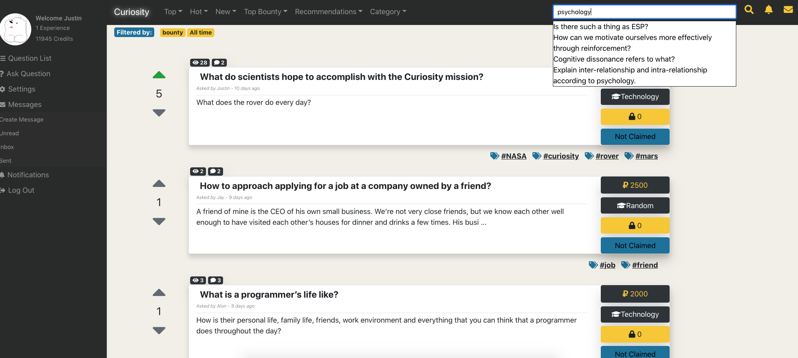
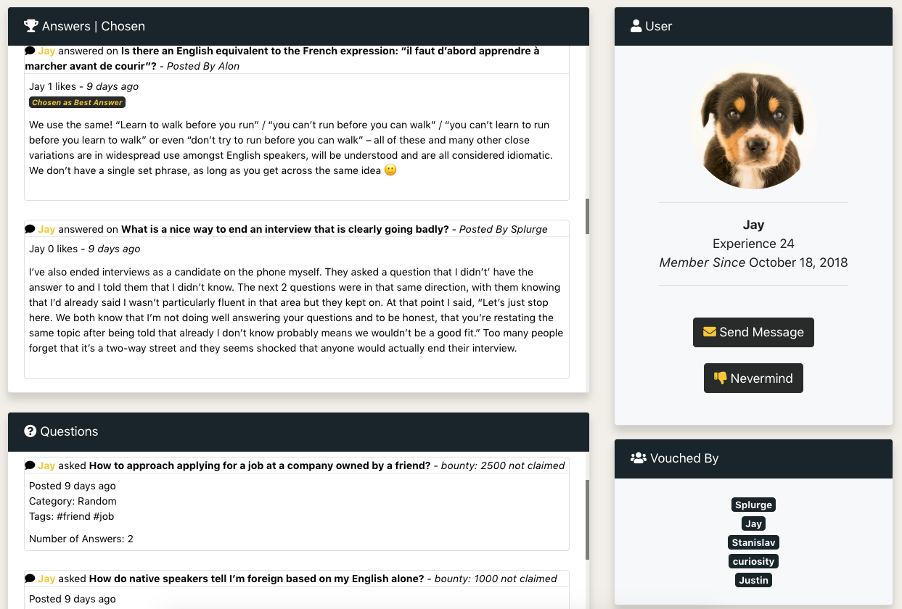

# Curiosity

Curiosity is a rewards based question and answer platform.

## Table of Contents

1. [Team](#team)
1. [Features](#features)
1. [Screenshots](#screenshots)
1. [Built With](#built-with)
1. [Git Workflow](#git-workflow)
1. [Styling](#styling)
1. [Styling](#license)

## Team

**Team Members**: Hyun Jae Paek, Stanislav Savciuc, Justin Chung

## Features

- Dynamic filtering and loading of questions
- Payment processing using Stripe
- Credit based transaction system
- Realtime messaging and notification system
- Comprehensive search autocomplete
- Recommendations based on user customization
- Signup and login using Google, Facebook, Twitter, Github, or Email

## Screenshots

## Built With

- [React](https://reactjs.org/)
- [GraphQL](https://graphql.org/)
- [Apollo](https://www.apollographql.com/)
- [Express](https://expressjs.com/)
- [MongoDB](https://www.mongodb.com/)
- [Firebase](http://firebase.google.com/)
- [Stripe](https://www.stripe.com/)

## Git Workflow

[Curiosity Workflow](WORKFLOW.md).

## Styling

Curiosity uses the [Airbnb JavaScript Style Guide](https://github.com/airbnb/javascript/).

## License

Curiosity uses the [MIT License](LICENSE.md).
